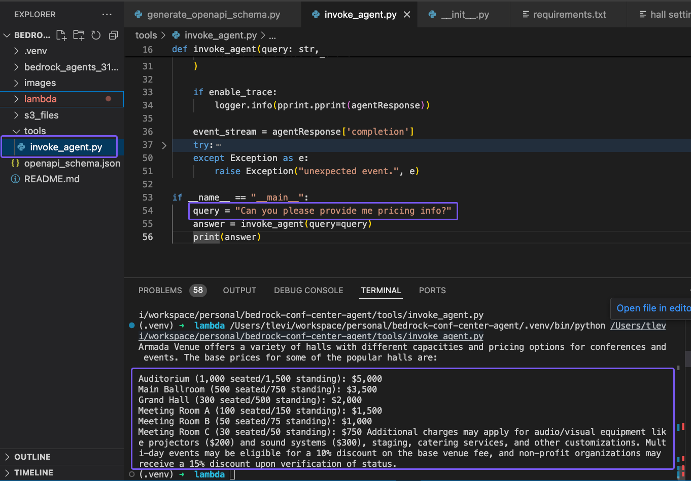

## Conference Center Chatbot Application

We will build a chatbot application powered by Bedrock Agent, <br/>
Foundation Model, Static documents in a Knowledge Base and Lambda function as a backend service. <br/>
The Lambda function will be powered by AWS Lambda Powertools.

### Solution architecture


Source: https://github.com/build-on-aws/bedrock-agents-streamlit/blob/main/streamlit_app/images/diagram.png

### Step 1: Create S3 bucket and files
* Domain Data Bucket: Create an S3 bucket to store the domain data. For example, call the S3 bucket knowledgebase-bedrock-agent-{alias}. We will use the default settings.
* Upload the files under `s3_files` into the new bucket

### Step 2: Knowledge Base Setup in Bedrock Agent
Before we setup the knowledge base, we will need to grant access to the models that will be needed for our Bedrock agent. Navigate to the Amazon Bedrock console, then on the left of the screen, scroll down and select Model access. On the right, select the orange Manage model access button.


* Select the checkbox for the base model columns Amazon: Titan Embeddings V2 - Text and Anthropic: Claude 3 Sonnet. 
This will provide you access to the required models. After, scroll down to the bottom right and select Request model access.

* Now, we will create a knowledge base by selecting Knowledge base on the left, then selecting the orange button Create knowledge base.


* Modify the knowledge base name and create


* Setup data source
Set the value of S3 URI to the bucket you've created at the beggining.


* For the embedding model, choose Titan Text Embeddings v2. Leave the other options as default.

* Review and select Create knolege base - it may take a few minutes.


* Once the knoledge base is ready open the Data source and select Sync

### Step 3: Creating Agent backend Lambda function 

#### Generate the OpenAPI Schema
The schema will be used by Berock Agent to interact with our Lambda function.
To generate the schema run this in the `lambda` directory:
```
python reservations/generate_openapi_schema.py
```
Copy the output into a file `openapi_schema.json`, and upload it to the S3 bucket you've created.

##### Deploy the Agent backend Lambda function using SAM
Make sure you have SAM cli and AWS account permissions, then run the below in Terminal:
```
sam build --cached
sam deploy --guided
```

* During the guided deployment, SAM will create `samconfig.toml` file according to your input:
```
version = 0.1
[default.deploy.parameters]
stack_name = "armada-conf-center-bedrock-agents"
resolve_s3 = true
s3_prefix = "armada-conf-center-bedrock-agents"
region = "us-east-1"
confirm_changeset = false
capabilities = "CAPABILITY_IAM"
disable_rollback = true
image_repositories = []
```

* Once the deployment is over you will see a message similiar to:
```
Successfully created/updated stack - armada-conf-center-bedrock-agents in us-east-1
```

* Open AWS Console -> Lambda -> Functions and filter by name


### Step 4: Setup Bedrock Agent
* Navigate to the Bedrock console. Go to the toggle on the left, and under Builder tools select Agents
* Select Create Agent, the agent description is optional, and we will use the default new service role. For the model, select Anthropic: Claude 3 Sonnet. Next, provide the following instruction for the agent:

```
Role: Virtual Assistant for Aramada Conference Center and Venue

Objective: Assist potential and existing customers with inquiries regarding event hosting at the venue by providing information on event policies, pricing, hall features, and availability.

Customer Inquiries and Responses:

The AI agent should be able to understand natural language queries from customers and respond with relevant information based on the provided documents:

Event Policy:

Understanding the Query: Identify keywords or phrases related to event policies, such as "cancellation policy," "food and beverage services," or "insurance requirements."
Response: Provide summaries of relevant sections from the Event Policy document (Document 1).
Example: "For cancellations made more than 90 days before the event, you will receive a full refund of your deposit."
Pricing and Availability:

Understanding the Query: Identify keywords or phrases related to pricing, hall capacity, or specific halls (e.g., "Auditorium pricing," "availability for a 100 person event").
Response:
If a specific hall is requested, provide the base price, capacity (seated and standing), and any additional relevant information from the Pricing Document (Document 2).
If a general inquiry is made about hall availability for a certain number of people, suggest suitable halls based on capacity and mention base prices.
Advise the user to check the latest pricing and availability through the official booking system (if applicable).
Hall Settings and Customization:

Understanding the Query: Identify keywords or phrases related to hall features, equipment, or customization options (e.g., "projector rental," "seating arrangements," "WiFi availability").
Response:
Inform the user about the standard amenities available in all halls (Document 3).
Provide information on availability and additional charges for equipment and customizations (e.g., projector rental, specific table configurations).
Advise the user to check with the venue for availability of specific customizations and to book them in advance.
Additional Considerations:

The AI agent should be able to handle multiple inquiries within a single conversation and link relevant information across different documents.
When the user's request requires contacting a human representative (e.g., complex booking inquiries), the agent should provide clear instructions on how to reach the venue staff.
The AI agent should be regularly updated with any changes to the event policies, pricing, or hall settings.
 
```


* After, scroll to the top and Save

#### Add a action group
The action group will be using the Agent backend Lambda function.
To understand how to interact with the Lambda function it will use the OpenAPI specification.

* Call the action group: armada-conf-center-backend-lambda-action-group.
We will set the Action group type to Define with API schemas. Action group invocations should be set to select an existing Lambda function. For the Lambda function, select the Lambda we created earlier.

* For the Action group Schema, we will choose Select an existing API schema and set the S3 Url to the `openapi_schema.json` S3 path.


Step 5: Setup Knowledge Base with Bedrock Agent
* While on the Bedrock agent console, scroll down to Knowledge base and select Add. When integrating the KB with the agent, you will need to provide basic instructions on how to handle the knowledge base. For example, use the following:

```
Use this knowledge base when a user asks about data, such as pricing queries, venue policy, and venue room configurations.
```


* Review your input, then select Add.

* Scroll to the top and select Prepare so that the changes made are updated. Then select Save and exit.

### Step 6: Create an alias
* Create an alias (new version), and choose a name of your liking. After it's done, make sure to copy your Alias ID and Agent ID. You will need this in step 8.


### Step 7: Testing the agent
* While in the Bedrock console, select Agents under Builder tools and the agent you created. You should be able to enter prompts in the user interface provided to test your knowledge base and action groups from the agent.


* Example promptes for Knowlege base:
```
Can you please privide information about hall types and pricing?
```

```
is there WiFi access in Hall 1?
```

* Example prompts for Lambda / Action Groups:
```
I'd like to have a meeting with the coordination team. Can you help?
```


### Cleanup
After completing the setup and testing of the Bedrock Agent , follow these steps to clean up your AWS environment and avoid unnecessary charges:

* Delete S3 Buckets:

Navigate to the S3 console.
Select the bucket you created earlier/

* Remove Lambda Function via SAM CLI:
In the `Lambda` folder run this:
```
sam delete -stack-name armada-conf-center-bedrock-agents
```

* Delete Bedrock Agent:
In the Bedrock console, navigate to 'Agents'.
Select the created agent, then choose 'Delete'.

* Deregister Knowledge Base in Bedrock:
Access the Bedrock console, then navigate to “Knowledge base” under the Orchestration tab.
Select, then delete the created knowledge base.


### Development
```
pip install -r lambda/requirements.txt
```

* You can use `tools\invoke_agent.py` (boto3 required) to progermatically test the agent.
You will need to set the Agent ID, Alias ID, and AWS CLI profile.



# References
* https://github.com/build-on-aws/bedrock-agents-streamlit


